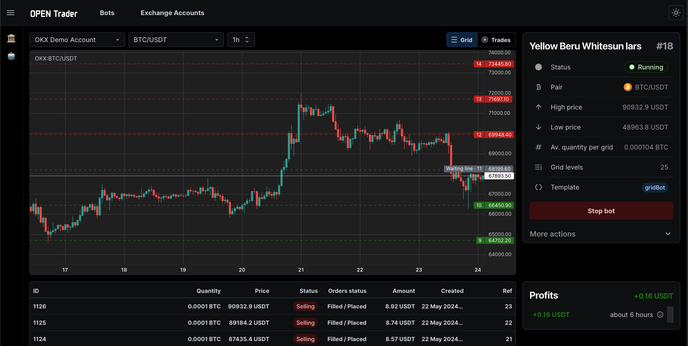

<p align="center">
  <a href="https://github.com/bludnic/opentrader" title="OpenTrader">
    
  </a>
</p>

[](https://github.com/bludnic/opentrader/actions)
[](https://github.com/bludnic/opentrader/graphs/contributors)
[](https://t.me/+cJLNxLSjcW83Njgy)

[OpenTrader](https://github.com/bludnic/opentrader) is an advanced cryptocurrency trading bot offering high-frequency, cross-exchange arbitrage and event-based strategies, including technical analysis with indicators. Features a user-friendly management UI, robust backtesting capabilities, and support for 100+ exchanges via CCXT.

**Strategies:**

- [x] [Grid](packages/bot-templates/src/templates/grid-bot.ts): A grid trading strategy that profits from the price fluctuation of an asset.
- [x] [RSI](packages/bot-templates/src/templates/rsi.ts): A Relative Strength Index (RSI) strategy that buys and sells based on the RSI indicator.
- [ ] `DCA`: Dollar-Cost Averaging (DCA) strategy that buys an asset at regular intervals.

**Supported exchanges:** `OKX`, `BYBIT`, `BINANCE`, `KRAKEN`, `COINBASE`, `GATEIO`

# Quick start

## Requirements

```bash
# NodeJS v18 or higher
$ node -v

# `pnpm` must be installed
$ pnpm -v

# Install Turborepo globally
$ pnpm install turbo --global

# Docker (optional)
$ docker -v
```

## Environment variables

The project uses a single `.env` file in the root directory.
Frameworks such as Next.js require the `.env` file to be located directly in the project directory.
To address this, some `apps/packages` might include a symlink pointing to the root `.env` file.

1. Create environment file `.env` in the root directory

```bash
$ cp .env.example .env
```

2. Replace the `DATABASE_URL` if your URL is different from the actual one.

## Installation

1. Install dependencies

```bash
$ pnpm install
```

2. Build `/packages/**`

```bash
$ turbo run build --filter='./packages/*'
```

3. Run db migrations

```bash
$ turbo run prisma:migrate
```

4. Seed the database

```bash
$ turbo run prisma:seed
```

> ⚠️ **Note**: Since the packages do not have a dev server, running the `build` command is mandatory on the first run.

# Basic usage

## Connect an exchange

Copy the `exchanges.default.json5` file to `exchanges.dev.json5` and add your API keys.

> Supported exchanges: OKX, BYBIT, BINANCE, KRAKEN, COINBASE, GATEIO

## Choose a strategy

Create the strategy configuration file `config.dev.json5`. We will use the `grid` strategy as an example.

```json5
{
  // Grid strategy params
  settings: {
    highPrice: 70000, // upper price of the grid
    lowPrice: 60000, // lower price of the grid
    gridLevels: 20, // number of grid levels
    quantityPerGrid: 0.0001, // quantity in base currency per each grid
  },
  pair: "BTC/USDT",
  exchange: "DEFAULT",
}
```

> Currently supported strategies: `grid`, `rsi`

## Run a backtest

Command: `pnpm opentrader backtest <strategy> --from <date> --to <date> -t <timeframe>`

Example running a `grid` strategy on `1h` timeframe.

```bash
$ pnpm opentrader backtest grid --from 2024-03-01 --to 2024-06-01 -t 1h
```

> To get more accurate results, use a smaller timeframe, e.g. 1m, however, it will take more time to download OHLC data from the exchange.

## Live trading

Command: `pnpm opentrader trade <strategy>`

Example running a live trading with `grid` strategy.

```bash
$ pnpm opentrader trade grid
```

> After `Ctrl+C`, the orders created by the bot will remain on the exchange. To cancel them, use the `pnpm opentrader stop` command.

# UI

The user interface allows managing multiple bots and strategies, viewing backtest results, and monitoring live trading.



Currently, the UI is under development. For early access, please email me at contact@opentrader.pro

After getting the access, run the following command to pull the UI into monorepo:

```shell
$ git submodule update --init
```

Run frontend app:

```shell
$ pnpm i
$ turbo run build --filter='./packages/*'
$ turbo run dev
```

- Frontend: http://localhost:3000
- API: http://localhost:4000

# Project structure

- Strategies dir: [packages/bot-templates](/packages/bot-templates/src/templates)
- Indicators: [packages/indicators](/packages/indicators/src/indicators)
- Exchange connectors: [packages/exchanges](/packages/exchanges/src/exchanges)

# 🪪 License

Licensed under the [Apache 2.0](http://www.apache.org/licenses/LICENSE-2.0) License. See the [LICENSE](LICENSE) file for more information.
