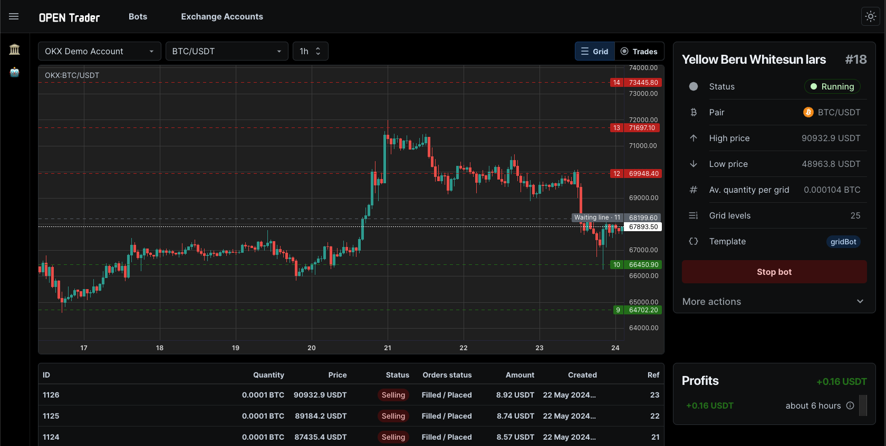

<p align="center">
  <a href="https://github.com/bludnic/opentrader" title="OpenTrader">
    
  </a>
</p>

[](https://github.com/bludnic/opentrader/actions)
[](https://www.npmjs.com/package/opentrader)
[](https://github.com/bludnic/opentrader/graphs/contributors)
[](https://x.com/intent/follow?screen_name=OpenTraderLabs)
[](https://discord.gg/RS7y3ffvvG)
[](https://www.reddit.com/r/OpenTrader)
[](https://t.me/+cJLNxLSjcW83Njgy)

[OpenTrader](https://github.com/bludnic/opentrader) is a self-hosted cryptocurrency trading bot, featuring built-in and highly customizable strategies, integration with technical indicators, high-frequency trading, and cross-exchange trading with support for 100+ exchanges via CCXT.

**Features:**

- **✨ Robust UI**: A user-friendly interface for managing the bots.
- **🌐 Multiple Exchanges:** Trade across various cryptocurrency exchanges.
- **📝 Paper Trading**: Test your strategies without risking real money.
- **📊 Backtesting:** Backtest your strategies using historical data.
- **⚙️ Easy Installation:** Install effortlessly via NPM.

**Strategies:**

- ☑️ [GRID](packages/bot-templates/src/templates/grid-bot.ts): Make profits from market fluctuations by creating a grid of buy and sell orders.
- ☑️ [DCA](packages/bot-templates/src/templates/dca.ts): Entry with multiple orders to average the entry price and sell on price swings.
- ☑️ [RSI](packages/bot-templates/src/templates/rsi.ts): Places orders based on the RSI indicator value.
- 🛠️ [CUSTOM](https://github.com/Open-Trader/custom-strategy): Build your own strategy in just a few lines of code.

# 💓 Status of the Project

This project is a personal passion, developed in my free time. If you find it useful, please give it a ⭐️. Your support means a lot and motivates me to keep improving the bot. If you'd like to make a [donation](#Donate), see the options below. 💖

# 🍩 Donate

If you find OpenTrader useful and would like to support its development, consider making a donation. Your contributions will help cover the costs of maintaining and improving this project.

**Donate via:**

- **Bitcoin (BTC):** `1LBqWWne1ac455UmUDVF32ozVAhy1HgVXn`
- **Ethereum (ETH):** `0x60371d49F9Cc7ec7d7e34979D5DD31996B7B43Ff`

Thank you for your support!

# 👋🏻 Join our Community

👥 Connect with developers, request features, and receive support. Join our community on [Discord](https://discord.gg/RS7y3ffvvG).

[](https://discord.gg/RS7y3ffvvG)
[](https://t.me/+cJLNxLSjcW83Njgy)
[](https://www.reddit.com/r/OpenTrader)

🔔 For announcements and updates, follow us on [Twitter](https://twitter.com/intent/follow?screen_name=OpenTraderLabs) and [Telegram](https://t.me/opentrader_pro).

[](https://twitter.com/intent/follow?screen_name=OpenTraderLabs)
[](https://t.me/opentrader_pro)

# ⚡️ Quick start

Get started with OpenTrader in just a few steps. Follow this quick guide to install, configure, and run your crypto trading bot.

> [!NOTE]
> OpenTrader requires Node.js v22 or higher. You can check your Node.js version by running `node -v`

## Installation

1. Install OpenTrader globally using npm:

```bash
npm install -g opentrader
```

2. Set an admin password for later accessing the OpenTrader UI:

```bash
opentrader set-password <password>
```

3. Start the OpenTrader app

```bash
opentrader up
```

The app will start the RPC server and listen on port 8000.

> **Tip**: Use `opentrader up -d` to start the app as a daemon. To stop it, run `opentrader down`.

# Usage

## UI

The user interface allows managing multiple bots and strategies, viewing backtest results, and monitoring live trading.



You can access the OpenTrader UI on: http://localhost:8000

## CLI

### Connect an exchange

Copy the `exchanges.sample.json5` file to `exchanges.json5` and add your API keys.

> Available exchanges: OKX, BYBIT, BINANCE, KRAKEN, COINBASE, GATEIO, BITGET

### Choose a strategy

Create the strategy configuration file `config.json5`. We will use the `grid` strategy as an example.

```json5
{
  // Grid strategy params
  settings: {
    highPrice: 70000, // upper price of the grid
    lowPrice: 60000, // lower price of the grid
    gridLevels: 20, // number of grid levels
    quantityPerGrid: 0.0001, // quantity in base currency per each grid
  },
  pair: "BTC/USDT",
  exchange: "DEFAULT",
}
```

> Currently supported strategies: `grid`, `dca`, `rsi`

### Run a backtest

Command: `opentrader backtest <strategy> --from <date> --to <date> -t <timeframe>`

Example running a `grid` strategy on `1h` timeframe.

```bash
opentrader backtest grid --from 2024-03-01 --to 2024-06-01 -t 1h
```

> To get more accurate results, use a smaller timeframe, e.g. 1m, however, it will take more time to download OHLC data from the exchange.

### Running a Live Trading

Command: `opentrader trade <strategy>`

Example running a live trading with `grid` strategy.

```bash
opentrader trade grid
```

> To stop the live trading, run `opentrader stop`

# Deployment

The [quick start](#️-quick-start) above installs OpenTrader globally via npm. For a VPS, container, or cloud dev environment, use one of the options below.

## PM2

[PM2](https://pm2.keymetrics.io/) keeps the bot running after logout and can restart it on crash or reboot. Works with the global npm install.

```bash
npm install -g opentrader pm2
opentrader set-password <password>
pm2 start opentrader --name opentrader -- up
```

Open the UI at http://localhost:8000.

Useful commands:

```bash
pm2 logs opentrader    # tail logs
pm2 restart opentrader
pm2 stop opentrader
pm2 save               # persist process list
pm2 startup            # generate boot script (run once, then follow its output)
```

> `opentrader up -d` also runs in the background, but PM2 adds supervision and survives SSH disconnects more reliably on a VPS.

## Docker

Build and run from a cloned repository. The `dev` service ships the CLI/UI in a single container with SQLite data on a host volume.

```bash
git clone https://github.com/Open-Trader/opentrader.git
cd opentrader
docker compose up -d --build dev
```

- UI: http://localhost:5000
- Default password: `opentrader` (set `ADMIN_PASSWORD` in `docker-compose.yml` before first run)
- Database and config persist in `./opentrader_data`

Stop and remove:

```bash
docker compose down
```

See [CONTRIBUTING.md](CONTRIBUTING.md) for the full multi-service layout (`processor`, `monolith`, etc.).

## GitHub Codespaces

The repo includes a [dev container](.devcontainer/devcontainer.json) with Node, pnpm, and Docker-in-Docker preconfigured.

1. On GitHub: **Code → Codespaces → Create codespace on `dev`**
2. In the codespace terminal:

```bash
cp .env.example .env
pnpm install
moon run prisma:migrate
moon run prisma:seed
moon run :build
./bin/cli.sh up
```

3. Open the forwarded port for `8000` when VS Code prompts you.

For UI/backend development, use `moon run :dev` instead — see [CONTRIBUTING.md](CONTRIBUTING.md#ui).

# Project structure

- Strategies dir: [packages/bot-templates](/packages/bot-templates/src/templates)
- Indicators: [packages/indicators](/packages/indicators/src/indicators)
- Exchange connectors: [packages/exchanges](/packages/exchanges/src/exchanges)

# 🪪 License

Licensed under the [Apache 2.0](http://www.apache.org/licenses/LICENSE-2.0) License. See the [LICENSE](LICENSE) file for more information.

# Disclaimer

This software is for educational purposes only. USE THE SOFTWARE AT YOUR OWN RISK. THE AUTHORS AND ALL AFFILIATES ASSUME NO RESPONSIBILITY FOR YOUR TRADING RESULTS. Do not risk money that you are afraid to lose. There might be bugs in the code - this software DOES NOT come with ANY warranty.
